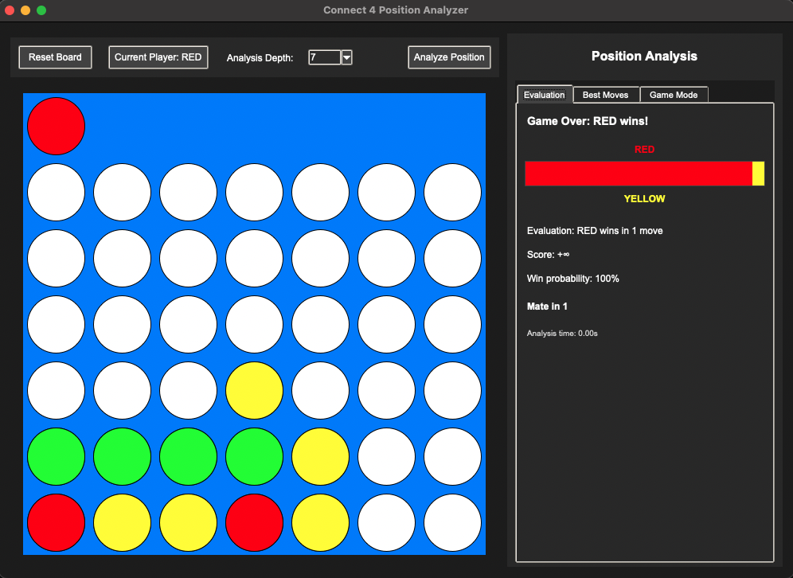

# Connect 4 Analysis Tool



This is a comprehensive Connect 4 position analyzer that can determine the winner from any position in a Connect 4 game. The application includes:

1. **Connect 4 Position Analyzer**: A powerful engine that can predict the outcome of any Connect 4 position with perfect play.
2. **Position Evaluation**: Provides evaluations with scores and win probabilities.
3. **Mate Detection**: Identifies forced wins and indicates "mate in X" sequences.
4. **Game Mode**: Option to play against the AI (available as a secondary feature).

## Mathematical Complexity

Connect 4 is a solved game with first-player win (with perfect play). Some key metrics:
- Standard board: 7 columns × 6 rows
- Total possible positions: ~4.5 trillion
- Legal positions reachable in gameplay: ~4.5 billion
- First solved by Victor Allis (1988) and independently by John Tromp (1995)

## Dataset

This implementation includes a dataset-based AI option that uses John Tromp's Connect 4 dataset:
- Contains 67,557 unique, legal 8-ply positions
- Each position is labeled with the game-theoretic outcome (win, loss, or draw) with perfect play
- Dataset distribution: 44,473 wins (65.83%), 16,635 losses (24.62%), 6,449 draws (9.55%)

## Features

- **Position Analysis**: Analyze any Connect 4 position to determine the expected outcome with perfect play
- **Win Probability**: Get probability estimates for each player based on the current position
- **Evaluation Bar**: Visual representation of advantage similar to chess engines
- **Mate Detection**: Find "mate in X" sequences and forced wins
- **Best Moves Ranking**: View a ranked list of best moves for the current position
- **Game Mode**: Option to play against the AI with adjustable difficulty

## Structure

- `connect4_analyzer.py` - Main application launcher with command-line options
- `dataset_analyzer.py` - Tool for analyzing positions using the Connect 4 dataset
- `play_connect4.py` - Play Connect 4 with switchable AI types (minimax or dataset)
- `python/` - Python implementation of the Connect 4 analysis tools
  - `connect4.py` - Core game logic and rules
  - `ai.py` - AI implementation using minimax with alpha-beta pruning
  - `dataset_ai.py` - Dataset-based AI implementation using optimal moves
  - `evaluator.py` - Position evaluation and mate detection
  - `game_engine.py` - Enhanced engine for position analysis
  - `position_analyzer.py` - Position analysis focused GUI
  - `gui_app.py` - Game-oriented graphical user interface
  - `play_dataset_game.py` - Play Connect 4 specifically with the dataset-based AI

- Additional theoretical implementations:
  - `Connect4.tla` - TLA+ specification for formal verification
  - `Connect4.v` - Coq implementation for theorem proving

## Getting Started

1. Install the required Python packages:
   ```
   pip install -r requirements.txt
   ```

2. Install tkinter (if not included with your Python installation):
   - On Ubuntu/Debian: `sudo apt-get install python3-tk`
   - On macOS: tkinter should be included with Python from python.org or Homebrew
   - On Windows: tkinter is included with the standard Python installation

## Usage

### Playing Connect 4

To play Connect 4 with the AI, you have several options:

1. Play with automatic AI selection (prefers dataset-based AI if available):
   ```
   python play_connect4.py
   ```

2. Explicitly choose the AI type:
   ```
   python play_connect4.py --ai minimax   # Use traditional minimax AI
   python play_connect4.py --ai dataset   # Use dataset-based AI
   ```

3. Adjust the depth for minimax search (higher is stronger but slower):
   ```
   python play_connect4.py --ai minimax --depth 7
   ```

### Analyzing Positions

1. For interactive position analysis with the dataset:
   ```
   python dataset_analyzer.py
   ```
   
2. For full analysis with the position analyzer GUI:
   ```
   python connect4_analyzer.py
   ```
   - On macOS: `brew install python-tk@3.11`
   - On Ubuntu/Debian: `sudo apt-get install python3-tk`
   - On Windows: Tkinter comes with the standard Python installation

3. Run the Position Analyzer (default mode):
   ```
   python connect4_analyzer.py
   ```

4. Or run the game mode:
   ```
   python connect4_analyzer.py --game
   ```

## Mathematical Approach

The tool uses several computational approaches:
1. Minimax algorithm with alpha-beta pruning
2. Enhanced evaluation function
3. Mate detection
4. Forced sequence detection

## License

MIT License